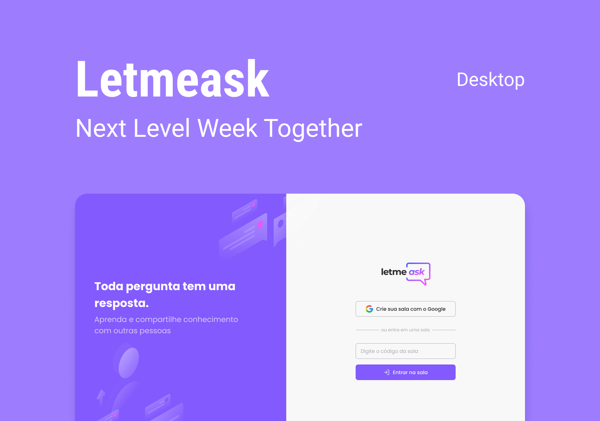

<h1 align="center">
    
</h1>

<p align="center">
  <a href="#-project">Project</a>&nbsp;&nbsp;&nbsp;|&nbsp;&nbsp;&nbsp;
  <a href="#technologies">Technologies</a>&nbsp;&nbsp;&nbsp;|&nbsp;&nbsp;&nbsp;
  <!-- <a href="#-preview">Preview</a>&nbsp;&nbsp;&nbsp;|&nbsp;&nbsp;&nbsp; -->
  <a href="#-layout">Getting started</a>&nbsp;&nbsp;&nbsp;|&nbsp;&nbsp;&nbsp;  
  <a href="#-layout">Layout</a>&nbsp;&nbsp;&nbsp;|&nbsp;&nbsp;&nbsp;
  <a href="#-license">License</a>
</p>

<p align="center">
   
</p>

<br>

<p align="center">
  
</p>

## 💻 Project
<!-- [Move.it](https://moveit-weslley-oliveira.vercel.app/)  -->
Letmeask helps you answer questions more efficiently ! 💜 

This is a project developed during the **[Next Level Week](https://nextlevelweek.com/)**, presented by **[@Rocketseat](https://github.com/Rocketseat)** during June 20-27, 2021.

## 🧪 Technologies

This project was developed using the following technologies:

- [React](https://reactjs.org)
- [TypeScript](https://www.typescriptlang.org/)
- [HTML5]()
- [Sass]()
- [Firebase]()

## 🔥 Preview

[![Deploy with Firebase]](https://letmeask-f890b.web.app/)

## 🚀 Getting started

Clone the project and access the folder

```bash
$ git clone https://github.com/weslley-oliveira/letmeask-nlw.git && cd letmeask-nlw
```

Follow the steps below
```bash
# Install the dependencies
$ yarn install

# Start the project
$ yarn start
```


## 🔖 Layout

You can view the project layout through the links below:

- [Layout Web](https://www.figma.com/file/B39wAzVdMmlmFSZY44rmxN/Letmeask-(Copy)?node-id=0%3A1) 

Remembering that you need to have a [Figma](http://figma.com/) account to access it.

## 📝 License

This project is licensed under the MIT License. See the [LICENSE](LICENSE.md) file for details.


---
<p align="center">Made with 💜 by Weslley Oliveira</p>

